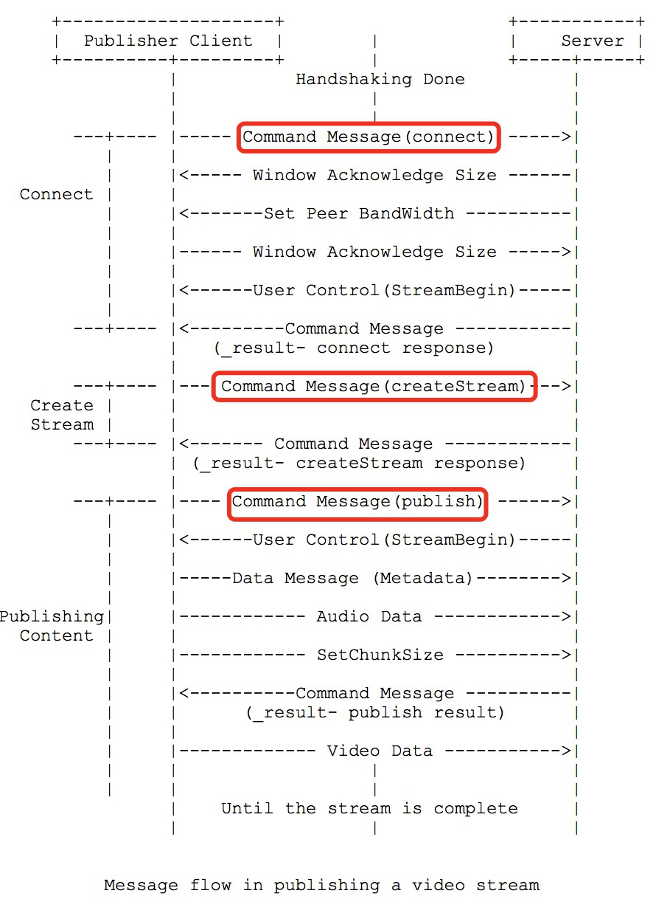
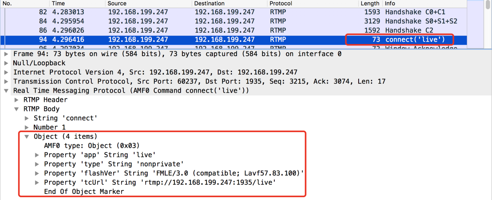
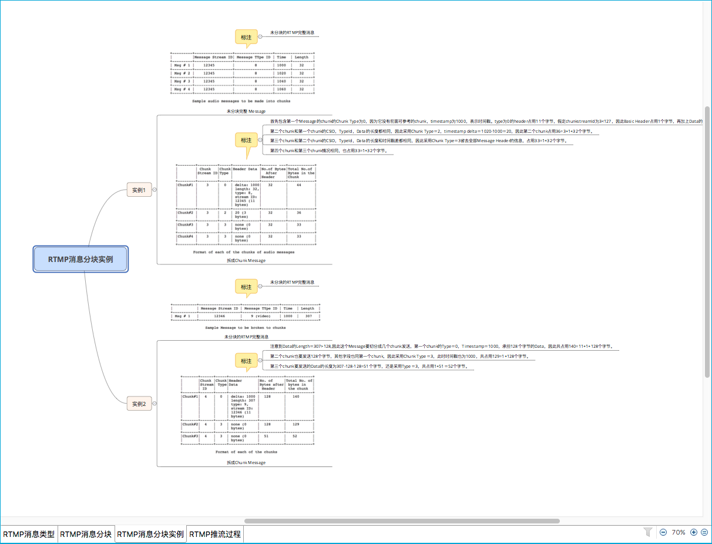

## **直播RTMP协议详解与注意事项**

### **1.** **简介**

RTMP协议是Real Time Message Protocol(实时信息传输协议)的缩写，它是由Adobe公司提出的一种应用层的协议，用来解决多媒体数据传输流的多路复用（Multiplexing）和分包（packetizing）的问题。随着VR技术的发展，视频直播等领域逐渐活跃起来，RTMP作为业内广泛使用的协议也重新被相关开发者重视起来。本文主要分享对RTMP的一些简介和实际开发中遇到的一些状况。

**RTMP协议基本特点：**

• 基于TCP协议的应用层协议

• 默认通信端口1935

**直播基本流程：**

 

 

可以看到RTMP 工作在直播推流和拉流两个位置，主要用作音视频媒体数据的传输，推流主要通过RTMP协议，而拉流还可以通过HLS和Http-FLV两种方式。

### 2. **RTMP 握手**

RTMP 握手分为简单握手和复杂握手，现在Adobe公司使用RTMP协议的产品用复杂握手的较多，不做介绍。

### **握手包格式：**

```c++
 0 1 2 3 4 5 6 7
+-+-+-+-+-+-+-+-+
|     version   |
+-+-+-+-+-+-+-+-+
 C0 and S0 bits
```


C0和S0：1个字节，包含了RTMP版本, 当前RTMP协议的版本为 3 

```c++
 0                   1                   2                   3
 0 1 2 3 4 5 6 7 8 9 0 1 2 3 4 5 6 7 8 9 0 1 2 3 4 5 6 7 8 9 0 1
+-+-+-+-+-+-+-+-+-+-+-+-+-+-+-+-+-+-+-+-+-+-+-+-+-+-+-+-+-+-+-+-+
|                           time (4 bytes)                      |
+-+-+-+-+-+-+-+-+-+-+-+-+-+-+-+-+-+-+-+-+-+-+-+-+-+-+-+-+-+-+-+-+
|                           zero (4 bytes)                      |
+-+-+-+-+-+-+-+-+-+-+-+-+-+-+-+-+-+-+-+-+-+-+-+-+-+-+-+-+-+-+-+-+
|                           random bytes                        |
+-+-+-+-+-+-+-+-+-+-+-+-+-+-+-+-+-+-+-+-+-+-+-+-+-+-+-+-+-+-+-+-+
|                           random bytes                        |
|                               (cont)                          |
|                               ....                            |
+-+-+-+-+-+-+-+-+-+-+-+-+-+-+-+-+-+-+-+-+-+-+-+-+-+-+-+-+-+-+-+-+
                        C1 and S1 bits
```


C1和S1：4字节时间戳，4字节的0，1528字节的随机数

```c++

  0                   1                   2                   3
  0 1 2 3 4 5 6 7 8 9 0 1 2 3 4 5 6 7 8 9 0 1 2 3 4 5 6 7 8 9 0 1
 +-+-+-+-+-+-+-+-+-+-+-+-+-+-+-+-+-+-+-+-+-+-+-+-+-+-+-+-+-+-+-+-+
 |                          time (4 bytes)                       |
 +-+-+-+-+-+-+-+-+-+-+-+-+-+-+-+-+-+-+-+-+-+-+-+-+-+-+-+-+-+-+-+-+
 |                          time2 (4 bytes)                      |
 +-+-+-+-+-+-+-+-+-+-+-+-+-+-+-+-+-+-+-+-+-+-+-+-+-+-+-+-+-+-+-+-+
 |                          random echo                          |
 +-+-+-+-+-+-+-+-+-+-+-+-+-+-+-+-+-+-+-+-+-+-+-+-+-+-+-+-+-+-+-+-+
 |                          random echo                          |
 |                             (cont)                            |
 |                              ....                             |
 +-+-+-+-+-+-+-+-+-+-+-+-+-+-+-+-+-+-+-+-+-+-+-+-+-+-+-+-+-+-+-+-+
                            C2 and S2 bits
```

 

C2和S2：4字节时间戳，4字节从对端读到的时间戳，1528字节随机数

 

### **RTMP握手基本过程：** 

```
+-------------+                            +-------------+
|   Client    |      TCP/IP Network        |     Server  |
+-------------+             |              +-------------+
       |                    |                     |
Uninitialized               |                Uninitialized
       |        C0          |                     |
       |------------------->|           C0        |
       |                    |-------------------->|
       |        C1          |                     |
       |------------------->|           S0        |
       |                    |<--------------------|
       |                    |           S1        |
  Version sent              |<--------------------|
       |        S0          |                     |
       |<-------------------|                     |
       |        S1          |                     |
       |<-------------------|               Version sent
       |                    |           C1        |
       |                    |-------------------->|
       |        C2          |                     |
       |------------------->|           S2        |
       |                    |<--------------------|
    Ack sent                |                   Ack Sent
       |        S2          |                     |
       |<-------------------|                     |
       |                    |           C2        |
       |                    |-------------------->|
Handshake Done              |               Handshake Done
      |                     |                     |
          Pictorial Representation of Handshake
```


握手开始于客户端发送C0、C1块。服务器收到C0或C1后发送S0和S1。

当客户端收齐S0和S1后，开始发送C2。当服务器收齐C0和C1后，开始发送S2。

当客户端和服务器分别收到S2和C2后，握手完成。

**注意事项：** 在实际工程应用中，一般是客户端先将C0, C1块同时发出，服务器在收到C1 之后同时将S0, S1, S2发给客户端。S2的内容就是收到的C1块的内容。之后客户端收到S1块，并原样返回给服务器，简单握手完成。按照RTMP协议个要求，客户端需要校验C1块的内容和S2块的内容是否相同，相同的话才彻底完成握手过程，实际编写程序用一般都不去做校验。

RTMP握手的这个过程就是完成了两件事：

校验客户端和服务器端RTMP协议版本号

是发了一堆随机数据，校验网络状况。

 

### **3**.  RTMP 消息

RTMP消息格式：

```
  0                   1                   2                   3
  0 1 2 3 4 5 6 7 8 9 0 1 2 3 4 5 6 7 8 9 0 1 2 3 4 5 6 7 8 9 0 1
 +-+-+-+-+-+-+-+-+-+-+-+-+-+-+-+-+-+-+-+-+-+-+-+-+-+-+-+-+-+-+-+-+
 | Message Type |               Payload length                   |
 |   (1 byte)   |                   (3 bytes)                    |
 +-+-+-+-+-+-+-+-+-+-+-+-+-+-+-+-+-+-+-+-+-+-+-+-+-+-+-+-+-+-+-+-+
 |                          Timestamp                            |
 |                          (4 bytes)                            |
 +-+-+-+-+-+-+-+-+-+-+-+-+-+-+-+-+-+-+-+-+-+-+-+-+-+-+-+-+-+-+-+-+
 |                          Stream ID            |
 |                          (3 bytes)            |
 +-+-+-+-+-+-+-+-+-+-+-+-+-+-+-+-+-+-+-+-+-+-+-+-+
                         Message Header
```


• 1字节消息类型

• 3字节负载消息长度

• 4字节时间戳

• 3字节Stream ID，区分消息流

**注意事项：** 实际RTMP通信中并未按照上述格式去发送RTMP消息，而是将RTMP 消息分块发送，之后将介绍RTMP消息分块。

### **3.1**. RTMP 消息分块（chunking）

而对于基于TCP的RTMP协议而言，协议显得特别繁琐，但是有没有更好的替代方案。同时创建RTMP消息分块是比较复杂的地方，涉及到了AFM（也是Adobe家的东西）格式数据的数据。

### **RTMP消息块格式：**

```
 +--------------+----------------+--------------------+--------------+
 | Basic Header | Message Header | Extended Timestamp |  Chunk Data  |
 +--------------+----------------+--------------------+--------------+
 |                                                    |
 |<------------------- Chunk Header ----------------->|
                            Chunk Format
```


RTMP消息块构成：

• Basic Header

• Message Header

• Extended Timestamp

• Chunk Data

Chunk Basic header格式有3种:

格式1：

```
   0 1 2 3 4 5 6 7
  +-+-+-+-+-+-+-+-+
  |fmt|   cs id   |
  +-+-+-+-+-+-+-+-+
 Chunk basic header 1
```


格式2：

```
  0                   1
  0 1 2 3 4 5 6 7 8 9 0 1 2 3 4 5
 +-+-+-+-+-+-+-+-+-+-+-+-+-+-+-+-+
 |fmt|      0    |  cs id - 64   |
 +-+-+-+-+-+-+-+-+-+-+-+-+-+-+-+-+
      Chunk basic header 2
```


格式3：

```
  0 1 2 3 4 5 6 7 8 9 0 1 2 3 4 5 6 7 8 9 0 1 2 3
 +-+-+-+-+-+-+-+-+-+-+-+-+-+-+-+-+-+-+-+-+-+-+-+-+
 |fmt|         1 |          cs id - 64           |
 +-+-+-+-+-+-+-+-+-+-+-+-+-+-+-+-+-+-+-+-+-+-+-+-+
             Chunk basic header 3
```


注意事项：

**fmt**: 用于指定Chunk Header 里面 Message Header的类型，后面会介绍到

**cs id**: 是chunk stream id的缩写，同一个RTMP消息拆成的 chunk块拥有相同的 cs id, 用于区分chunk 所属的RTMP消息, chunk basic header 的类型cs id占用的字节数来确定

### **Message Header格式：**

Message Header的类型通过上文chunk basic header中的fmt指定，共4种:

格式0:

```
  0                   1                   2                   3
  0 1 2 3 4 5 6 7 8 9 0 1 2 3 4 5 6 7 8 9 0 1 2 3 4 5 6 7 8 9 0 1
 +-+-+-+-+-+-+-+-+-+-+-+-+-+-+-+-+-+-+-+-+-+-+-+-+-+-+-+-+-+-+-+-+
 |                          timestamp            | message length|
 +-+-+-+-+-+-+-+-+-+-+-+-+-+-+-+-+-+-+-+-+-+-+-+-+-+-+-+-+-+-+-+-+
 |      message length (cont)    |message type id| msg stream id |
 +-+-+-+-+-+-+-+-+-+-+-+-+-+-+-+-+-+-+-+-+-+-+-+-+-+-+-+-+-+-+-+-+
 |          message stream id (cont)             |
 +-+-+-+-+-+-+-+-+-+-+-+-+-+-+-+-+-+-+-+-+-+-+-+-+
                Chunk Message Header - Type 0
```

Message Header占用11个字节， 在chunk stream的开始的第一个chunk的时候必须采用这种格式。

• **timestamp**：3个字节，因此它最多能表示到16777215=0xFFFFFF=2^24-1, 当它的值超过这个最大值时，这三个字节都置为1，实际的timestamp会转存到Extended Timestamp字段中，接受端在判断timestamp字段24个位都为1时就会去Extended timestamp中解析实际的时间戳。

• **message length**：3个字节，表示实际发送的消息的数据如音频帧、视频帧等数据的长度，单位是字节。注意这里是Message的长度，也就是chunk属于的Message的总数据长度，而不是chunk本身Data的数据的长度。

• **message type id**：1个字节，表示实际发送的数据的类型，如8代表音频数据、9代表视频数据。

• **msg stream id**：4个字节，表示该chunk所在的流的ID，和Basic Header的CSID一样，它采用小端存储的方式

格式1：

```
  0                1                   2                   3
  0 1 2 3 4 5 6 7 8 9 0 1 2 3 4 5 6 7 8 9 0 1 2 3 4 5 6 7 8 9 0 1
 +-+-+-+-+-+-+-+-+-+-+-+-+-+-+-+-+-+-+-+-+-+-+-+-+-+-+-+-+-+-+-+-+
 |                          timestamp            | message length|
 +-+-+-+-+-+-+-+-+-+-+-+-+-+-+-+-+-+-+-+-+-+-+-+-+-+-+-+-+-+-+-+-+
 |      message length (cont)    |message type id|  
 +-+-+-+-+-+-+-+-+-+-+-+-+-+-+-+-+-+-+-+-+-+-+-+-+ 
                Chunk Message Header - Type 1 
```

Message Header占用7个字节，省去了表示msg stream id的4个字节，表示此chunk和上一次发的chunk所在的流相同。

• **timestamp delta**：3个字节，注意这里和格式0时不同，存储的是和上一个chunk的时间差。类似上面提到的timestamp，当它的值超过3个字节所能表示的最大值时，三个字节都置为1，实际的时间戳差值就会转存到Extended Timestamp字段中，接受端在判断timestamp delta字段24个位都为1时就会去Extended timestamp中解析时机的与上次时间戳的差值。

格式2：

```
  0                1                   2     
  0 1 2 3 4 5 6 7 8 9 0 1 2 3 4 5 6 7 8 9 0 1 2 3 
 +-+-+-+-+-+-+-+-+-+-+-+-+-+-+-+-+-+-+-+-+-+-+-+-+ 
 |                          timestamp            |  
 +-+-+-+-+-+-+-+-+-+-+-+-+-+-+-+-+-+-+-+-+-+-+-+-+ 
          Chunk Message Header - Type 2 
```

Message Header占用3个字节，相对于格式1，又省去了表示消息长度的3个字节和表示消息类型的1个字节，表示此chunk和上一次发送的chunk所在的流、消息的长度和消息的类型都相同。余下的这三个字节表示timestamp delta，使用同格式1。

格式3：

0字节，它表示这个chunk的Message Header和上一个是完全相同的，无需再次传送

### **Extended Timestamp（扩展时间戳）：**

在chunk中会有时间戳timestamp和时间戳差timestamp delta，并且它们不会同时存在，只有这两者之一大于3个字节能表示的最大数值0xFFFFFF＝16777215时，才会用这个字段来表示真正的时间戳，否则这个字段为0。

扩展时间戳占4个字节，能表示的最大数值就是0xFFFFFFFF＝4294967295。当扩展时间戳启用时，timestamp字段或者timestamp delta要全置为1，表示应该去扩展时间戳字段来提取真正的时间戳或者时间戳差。注意扩展时间戳存储的是完整值，而不是减去时间戳或者时间戳差的值。

**Chunk Data（块数据）**： 用户层面上真正想要发送的与协议无关的数据，长度在(0,chunkSize]之间, chunk size默认为128字节。

### **RTMP 消息分块注意事项**

• **Chunk Size**:

RTMP是按照chunk size进行分块，chunk size 指的是 chunk的payload部分的大小，不包括chunk basic header 和 chunk message header长度。客户端和服务器端各自维护了两个chunk size, 分别是自身分块的chunk size 和 对端 的chunk size, 默认的这两个chunk size都是128字节。通过向对端发送set chunk size 消息可以告知对方更改了 chunk size的大小。 

• **Chunk Type**:

RTMP消息分成的Chunk有4种类型，可以通过 chunk basic header的高两位(fmt)指定，一般在拆包的时候会把一个RTMP消息拆成以格式0开始的chunk，之后的包拆成格式3 类型的chunk，我查看了有不少代码也是这样实现的，这样也是最简单的实现。 

如果第二个message和第一个message的message stream ID 相同，并且第二个message的长度也大于了chunk size，那么该如何拆包？当时查了很多资料，都没有介绍。后来看了一些源码，如 SRS，FFMPEG中的实现，发现第二个message可以拆成Type_1类型一个chunk， message剩余的部分拆成Type_3类型的chunk。FFMPEG中就是这么做的。 

### 3.2  **RTMP 交互消息**

推流RTMP消息交互流程：

 

 

关于推流的过程，RTMP的协议文档上给了上图示例，说一下推流注意事项：

### **3.2.1** **Connect 消息**

RTMP 命令消息格式：

```
 +----------------+---------+---------------------------------------+
 |  Field Name    |   Type  |               Description             |
 +--------------- +---------+---------------------------------------+
 |   Command Name | String  | Name of the command. Set to "connect".|
 +----------------+---------+---------------------------------------+
 | Transaction ID | Number  |            Always set to 1.           |
 +----------------+---------+---------------------------------------+
 | Command Object | Object  |  Command information object which has |
 |                |         |           the name-value pairs.       |
 +----------------+---------+---------------------------------------+
 | Optional User  | Object  |       Any optional information        |
 |   Arguments    |         |                                       |
 +----------------+---------+---------------------------------------+
```


RTMP握手之后先发送一个connect 命令消息，命令里面包含什么东西，协议中没有具体规定，实际通信中要指定一些编解码的信息，并以AMF格式发送, 下面是用wireshake抓取connect命令需要包含的参数信息：

 

这些信息协议中并没有特别详细说明, 在librtmp，srs-librtmp这些源码中，以及用wireshark 抓包的时候可以看到。 

服务器返回的是一个_result命令类型消息，这个消息的payload length一般不会大于128字节，但是在最新的nginx-rtmp中返回的消息长度会大于128字节。 

消息的transactionID是用来标识command类型的消息的，服务器返回的_result消息可以通过 transactionID来区分是对哪个命令的回应，connect 命令发完之后还要发送其他命令消息，要保证他们的transactionID不相同。

发送完connect命令之后一般会发一个 set chunk size消息来设置chunk size 的大小，也可以不发。

Window Acknowledgement Size 是设置接收端消息窗口大小，一般是2500000字节，即告诉对端在收到设置的窗口大小长度的数据之后要返回一个ACK消息。在实际做推流的时候推流端要接收很少的服务器数据，远远到达不了窗口大小，所以这个消息可以不发。而对于服务器返回的ACK消息一般也不做处理，默认服务器都已经收到了所有消息了。 

之后要等待服务器对于connect消息的回应的，一般是把服务器返回的chunk都读完，组包成完整的RTMP消息，没有错误就可以进行下一步了。

### **3.2.2** **Create Stream 消息**

创建完RTMP连接之后就可以创建RTMP流，客户端要想服务器发送一个releaseStream命令消息，之后是FCPublish命令消息，在之后是createStream命令消息。

当发送完createStream消息之后，解析服务器返回的消息会得到一个stream ID。

 

这个ID也就是以后和服务器通信的 message stream ID, 一般返回的是1，不固定。

### **3.2.3** **Publish Stream**

推流准备工作的最后一步是 Publish Stream，即向服务器发一个publish命令消息，这个命令的message stream ID 就是上面 create stream 之后服务器返回的stream ID，发完这个命令一般不用等待服务器返回的回应，直接发送音视频类型的RTMP数据包即可。有些rtmp库还会发setMetaData消息，这个消息可以发也可以不发，里面包含了一些音视频meta data的信息，如视频的分辨率等等。

### **4. 推送音视频**

当以上工作都完成的时候，就可以发送音视频了。音视频RTMP消息的Payload(消息体)中都放的是按照FLV-TAG格式封的音视频包，具体可以参照FLV封装的协议文档。格式必须封装正确，否则会造成播放端不能正常拿到音视频数据，无法播放音视频。

### **5. 关于RTMP的时间戳**

RTMP的时间戳单位是毫秒ms，在发送音视频之前一直为零，发送音视频消息包后时候必须保证时间戳是单调递增的，时间戳必须打准确，否则播放端可能出现音视频不同步的情况。Srs-librtmp的源码中，如果推的是视频文件的话，发现他们是用H264的dts作为时间戳的。实时音视频传输的时候是先获取了下某一时刻系统时间作为基准，然后每次相机采集到的视频包，与起始的基准时间相减，得到时间戳，这样可以保证时间戳的正确性。

### **6. 关于Chunk Stream ID**

RTMP 的Chunk Steam ID是用来区分某一个chunk是属于哪一个message的 ，0和1是保留的。每次在发送一个不同类型的RTMP消息时都要有不用的chunk stream ID, 如上一个Message 是command类型的，之后要发送视频类型的消息，视频消息的chunk stream ID 要保证和上面 command类型的消息不同。每一种消息类型的起始chunk 的类型必须是 Type_0 类型的，表明新的消息的起始。

### **总结：**

RTMP协议是个比较啰嗦的协议，实现起来也比较复杂，但通信过程过程相对简单。在直播的实际工程应用中，协议上很多地方都没有详细说明，注意了以上提到几点，基本能够保证RTMP音视频的通信正常。以上就是对RTMP协议的简介和一些注意事项，希望能帮到有需要的朋友，另外本文难免有错误或说的不够详细的地方，欢迎指正，一起交流探讨。


-----

附：RTMP 协议整理成脑图，比较清晰，包括rtmp 消息类型，rtmp 分块chunking，rtmp分块例子。
免费脑图工具 [Xmind](http://www.xmindchina.net/) 格式.





